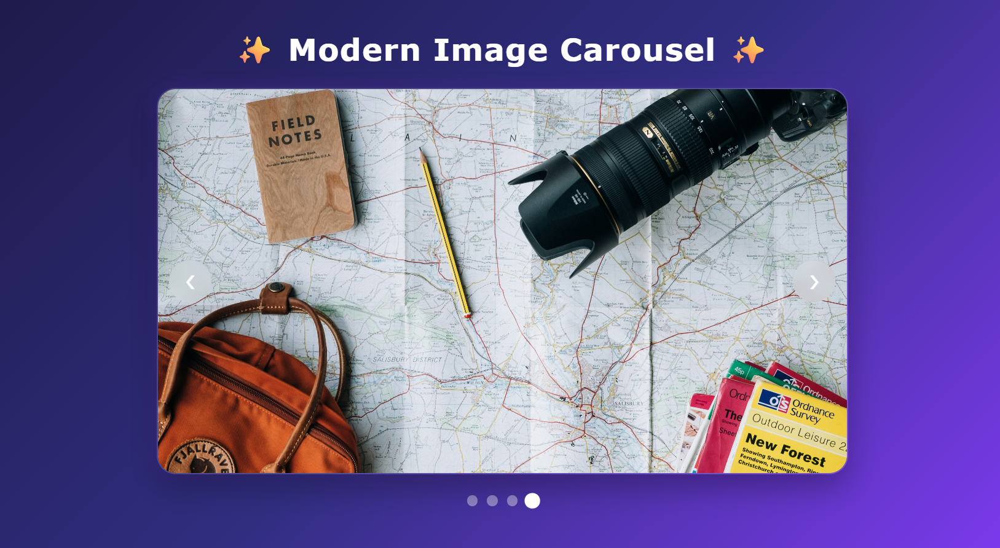
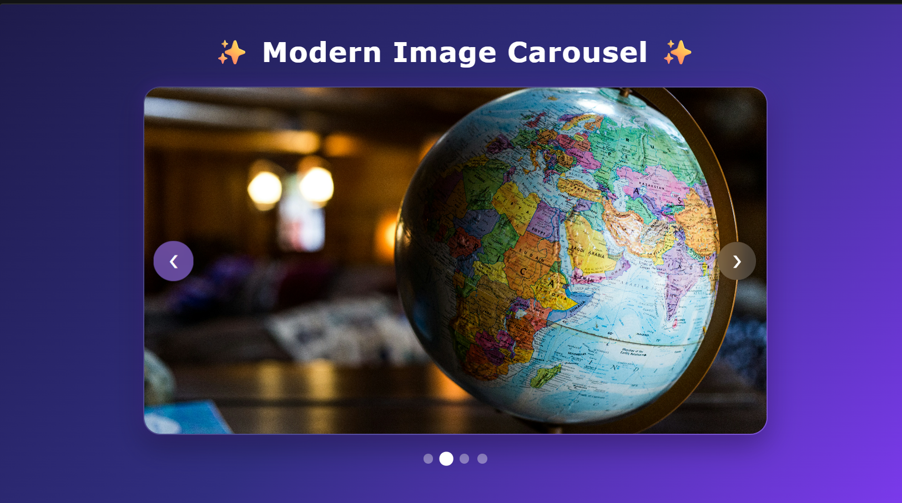

# Ex05 Image Carousel
## Date:

## AIM
To create a Image Carousel using React 

## ALGORITHM
### STEP 1 Initial Setup:
Input: A list of images to display in the carousel.

Output: A component displaying the images with navigation controls (e.g., next/previous buttons).

### Step 2 State Management:
Use a state variable (currentIndex) to track the index of the current image displayed.

The carousel starts with the first image, so initialize currentIndex to 0.

### Step 3 Navigation Controls:
Next Image: When the "Next" button is clicked, increment currentIndex.

If currentIndex is at the end of the image list (last image), loop back to the first image using modulo:
currentIndex = (currentIndex + 1) % images.length;

Previous Image: When the "Previous" button is clicked, decrement currentIndex.

If currentIndex is at the beginning (first image), loop back to the last image:
currentIndex = (currentIndex - 1 + images.length) % images.length;

### Step 4 Displaying the Image:
The currentIndex determines which image is displayed.

Using the currentIndex, display the corresponding image from the images list.

### Step 5 Auto-Rotation:
Set an interval to automatically change the image after a set amount of time (e.g., 3 seconds).

Use setInterval to call the nextImage() function at regular intervals.

Clean up the interval when the component unmounts using clearInterval to prevent memory leaks.

## PROGRAM
```
main.jsx
import React from "react";
import ReactDOM from "react-dom/client";
import App from "./App";
import "./App.css";

ReactDOM.createRoot(document.getElementById("root")).render(
  <React.StrictMode>
    <App />
  </React.StrictMode>
);
```
```
app.jsx
import React, { useState, useEffect } from "react";
import "./App.css";

function App() {
  const images = [
  "https://images.unsplash.com/photo-1502602898657-3e91760cbb34",
  "https://images.unsplash.com/photo-1521295121783-8a321d551ad2",
  "https://images.unsplash.com/photo-1537996194471-e657df975ab4",
  "https://images.unsplash.com/photo-1488646953014-85cb44e25828",
];

  const [currentIndex, setCurrentIndex] = useState(0);

  const nextSlide = () => {
    setCurrentIndex((prev) =>
      prev === images.length - 1 ? 0 : prev + 1
    );
  };

  const prevSlide = () => {
    setCurrentIndex((prev) =>
      prev === 0 ? images.length - 1 : prev - 1
    );
  };

  useEffect(() => {
    const interval = setInterval(nextSlide, 3500);
    return () => clearInterval(interval);
  }, []);

  return (
    <div className="container">
      <h1>✨ Modern Image Carousel ✨</h1>

      <div className="carousel">
        

        <button className="prev" onClick={prevSlide}>
          ❮
        </button>

        <button className="next" onClick={nextSlide}>
          ❯
        </button>
      </div>

      <div className="dots">
        {images.map((_, index) => (
          <span
            key={index}
            className={
              currentIndex === index ? "dot active" : "dot"
            }
            onClick={() => setCurrentIndex(index)}
          ></span>
        ))}
      </div>
    </div>
  );
}

export default App;import React, { useState, useEffect } from "react";
import "./App.css";

function App() {
  const images = [
  "https://images.unsplash.com/photo-1502602898657-3e91760cbb34",
  "https://images.unsplash.com/photo-1521295121783-8a321d551ad2",
  "https://images.unsplash.com/photo-1537996194471-e657df975ab4",
  "https://images.unsplash.com/photo-1488646953014-85cb44e25828",
];

  const [currentIndex, setCurrentIndex] = useState(0);

  const nextSlide = () => {
    setCurrentIndex((prev) =>
      prev === images.length - 1 ? 0 : prev + 1
    );
  };

  const prevSlide = () => {
    setCurrentIndex((prev) =>
      prev === 0 ? images.length - 1 : prev - 1
    );
  };

  useEffect(() => {
    const interval = setInterval(nextSlide, 3500);
    return () => clearInterval(interval);
  }, []);

  return (
    <div className="container">
      <h1>✨ Modern Image Carousel ✨</h1>

      <div className="carousel">
        

        <button className="prev" onClick={prevSlide}>
          ❮
        </button>

        <button className="next" onClick={nextSlide}>
          ❯
        </button>
      </div>

      <div className="dots">
        {images.map((_, index) => (
          <span
            key={index}
            className={
              currentIndex === index ? "dot active" : "dot"
            }
            onClick={() => setCurrentIndex(index)}
          ></span>
        ))}
      </div>
    </div>
  );
}

export default App;
```
```
app.css
* {
  margin: 0;
  padding: 0;
  box-sizing: border-box;
  font-family: Verdana, Geneva, sans-serif;
}

body {
  min-height: 100vh;
  background: linear-gradient(
    135deg,
    #1e1b4b,
    #312e81,
    #7c3aed
  );
}

.container {
  text-align: center;
  padding: 40px 20px;
}

.container h1 {
  color: #ffffff;
  margin-bottom: 25px;
  font-size: 2.5rem;
  letter-spacing: 1px;
}

.carousel {
  position: relative;
  max-width: 900px;
  margin: auto;
  overflow: hidden;
  border-radius: 25px;

  border: 2px solid rgba(255,255,255,0.15);

  box-shadow:
    0 15px 40px rgba(0,0,0,0.35),
    0 0 25px rgba(124,58,237,0.3);
}

.slide {
  width: 100%;
  height: 500px;
  object-fit: cover;
  display: block;
}

.prev,
.next {
  position: absolute;
  top: 50%;
  transform: translateY(-50%);

  border: none;
  width: 55px;
  height: 55px;
  border-radius: 50%;

  cursor: pointer;
  font-size: 24px;
  color: white;

  background: rgba(255,255,255,0.2);
  backdrop-filter: blur(10px);

  transition: 0.3s;
}

.prev:hover,
.next:hover {
  background: #8b5cf6;
  transform: translateY(-50%) scale(1.1);
}

.prev {
  left: 15px;
}

.next {
  right: 15px;
}

.dots {
  margin-top: 25px;
}

.dot {
  display: inline-block;
  width: 14px;
  height: 14px;
  margin: 0 6px;

  border-radius: 50%;
  cursor: pointer;

  background: rgba(255,255,255,0.4);
  transition: 0.3s;
}

.dot:hover {
  transform: scale(1.2);
}

.dot.active {
  background: #ffffff;
  transform: scale(1.4);
}

@media (max-width: 768px) {
  .slide {
    height: 300px;
  }

  .container h1 {
    font-size: 1.8rem;
  }

  .prev,
  .next {
    width: 45px;
    height: 45px;
    font-size: 18px;
  }
}
```


## OUTPUT



## RESULT
The program for creating Image Carousel using React is executed successfully.
